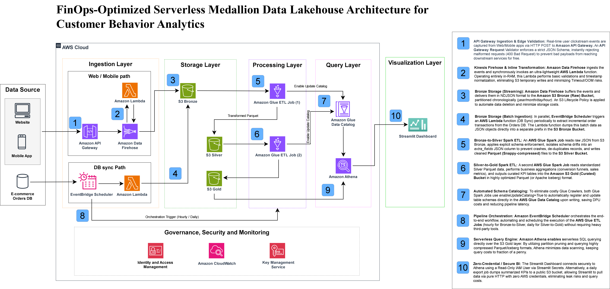

# FinOps-Optimized Serverless Medallion Data Lakehouse
> *Kiến trúc Data Lakehouse Serverless tối ưu chi phí theo mô hình Medallion*

<div align="center">

[](https://aws.amazon.com/)
[](https://streamlit.io)
[](https://spark.apache.org/)
[](LICENSE)

[Live Dashboard](http://3.217.165.2:8502/) · [Workshop Docs](https://htlinh0604.github.io/cloud-ai-journey-linhhuynh/) 

</div>

---

## Architecture

> *A fully serverless, FinOps-optimized data platform built on AWS - from real-time event ingestion to interactive business dashboards.*
>
> *Nền tảng dữ liệu serverless hoàn toàn, tối ưu chi phí trên AWS - từ tiếp nhận sự kiện thời gian thực đến dashboard nghiệp vụ tương tác.*

<div align="center">

  

*FinOps-Optimized Serverless Medallion Data Lakehouse Architecture for Customer Behavior Analytics*

**Kiến trúc Data Lakehouse Serverless Medallion tối ưu FinOps cho Phân tích Hành vi Khách hàng**

</div>

---

## Overview

This workshop guides you through building a **production-grade, serverless data lakehouse** on AWS that processes customer behavior data through a 4-tier Medallion architecture (Raw → Bronze → Silver → Gold), powered by AWS Glue, Amazon Athena, and visualized via a Streamlit dashboard on EC2.

> *Workshop này hướng dẫn bạn xây dựng một **data lakehouse serverless chuẩn production** trên AWS, xử lý dữ liệu hành vi khách hàng qua kiến trúc Medallion 4 tầng (Raw → Bronze → Silver → Gold), được vận hành bởi AWS Glue, Amazon Athena và trực quan hóa qua Streamlit dashboard trên EC2.*

---

## What You Will Build

A complete, end-to-end data analytics pipeline covering:

> *Một data analytics pipeline hoàn chỉnh, end-to-end bao gồm:*

| Layer | Services | Description |
|-------|----------|-------------|
| **Ingestion** | API Gateway, Firehose, Lambda, EventBridge | Real-time streaming + batch extraction |
| **Storage** | Amazon S3 (4-tier Medallion) | Raw → Bronze → Silver → Gold |
| **Processing** | AWS Glue (PySpark ETL) | 3-job pipeline with auto Catalog registration |
| **Query** | Amazon Athena | Serverless SQL on Parquet Gold tables |
| **Visualization** | Streamlit on EC2 | 8-chart interactive business dashboard |
| **Governance** | IAM, CloudWatch, KMS | Security, monitoring & alerting |

> *Ingestion: Streaming thời gian thực + trích xuất batch · Storage: S3 4 tầng Medallion · Processing: Glue ETL 3 jobs · Query: Athena serverless SQL · Visualization: Streamlit 8 biểu đồ · Governance: IAM, CloudWatch, KMS*

---

## Key Features

**Dual Ingestion Path**
Real-time clickstream events via API Gateway → Firehose; batch order data via EventBridge Scheduler → Lambda.
> *Hai đường tiếp nhận dữ liệu: clickstream thời gian thực qua API Gateway → Firehose; dữ liệu đơn hàng batch qua EventBridge → Lambda.*

**Medallion Architecture (Raw → Bronze → Silver → Gold)**
Data quality improves at each tier - CSV to Parquet, deduplication, normalization, KPI aggregation.
> *Chất lượng dữ liệu tăng dần qua từng tầng - CSV sang Parquet, loại trùng, chuẩn hóa, tổng hợp KPI.*

**Auto Glue Catalog Registration**
`silver_to_gold_job.py` automatically registers Gold tables in the Glue Data Catalog - no Crawlers needed, saving DPU-hours.
> *Job Silver → Gold tự động đăng ký bảng Gold vào Glue Data Catalog - không cần Crawler, tiết kiệm DPU-hour.*

**FinOps-First Design**
Parquet format reduces Athena scan costs by ~85%. Pay-per-use across all services. Workgroup query limits prevent runaway costs.
> *Định dạng Parquet giảm chi phí quét Athena ~85%. Tất cả dịch vụ trả theo mức dùng. Giới hạn truy vấn Workgroup tránh chi phí ngoài kiểm soát.*

**Live Analytics Dashboard**
Streamlit app with 8 interactive charts: revenue trends, geographic breakdown, device/payment/source analysis, event distribution.
> *Ứng dụng Streamlit với 8 biểu đồ tương tác: xu hướng doanh thu, phân tích địa lý, thiết bị/thanh toán/nguồn, phân phối sự kiện.*

---

## Repository Structure

```
FCAJ-workshop/
│
├── 📁 source_code/                   # ETL & application source code
│   ├── raw_to_bronze_job.py          # Glue Job 1: CSV/JSON → Parquet (Bronze)
│   ├── bronze_to_silver_job.py       # Glue Job 2: Deduplicate + Normalize (Silver)
│   ├── silver_to_gold_job.py         # Glue Job 3: KPI Aggregations + Auto Catalog (Gold)
│   ├── app_beautiful.py              # Streamlit Dashboard application
│   ├── athena_create_tables.sql      # Manual CREATE TABLE statements
│   └── athena_queries.sql            # Business query collection
│
├── 📁 content/                       # Hugo workshop documentation
│   ├── 5-Workshop/
│   │   ├── 5.1-Overview/             # Workshop overview
│   │   ├── 5.2-Prerequisite/         # Prerequisites & setup guide
│   │   ├── 5.3-Architecture/         # Architecture deep-dive
│   │   ├── 5.4-Steps/
│   │   │   ├── 5.4.1-VPC/            # Step 1: VPC & Networking
│   │   │   ├── 5.4.2-S3/             # Step 2: S3 & Data Upload
│   │   │   ├── 5.4.3-Glue/           # Step 3: AWS Glue ETL Jobs
│   │   │   ├── 5.4.4-Athena/         # Step 4: Amazon Athena Queries
│   │   │   ├── 5.4.5-EC2-Dashboard/  # Step 5: EC2 & Streamlit Dashboard
│   │   │   └── 5.4.6-Monitoring/     # Step 6: CloudWatch Monitoring
│   │   └── 5.5-Cleanup/              # Resource cleanup guide
│   ├── 6-Self-evaluation/            # Team self-assessment
│   └── 7-Feedback/                   # Program feedback & sharing
│
├── 📁 public/                        # Static assets
│   ├── images/                       # Architecture diagrams
│   └── result/                       # Workshop screenshots (S3, Glue, Athena, EC2...)
│
└── README.md                         # This file
```

---

## Quick Start

### Prerequisites
> *Điều kiện tiên quyết*

- AWS Account with billing enabled *(Tài khoản AWS với billing được bật)*
- AWS CLI v2 configured *(AWS CLI v2 đã cấu hình)*
- Python 3.9+ *(Python 3.9 trở lên)*
- IAM permissions: S3, Glue, Athena, EC2, VPC, CloudWatch, IAM *(Quyền IAM đầy đủ)*

### Installation
> *Cài đặt*

```bash
# Clone this repository
# Sao chép repository này
git clone https://github.com/HTLinh0604/cloud-ai-journey-linhhuynh.git
cd cloud-ai-journey-linhhuynh

# Install Python dependencies for local testing
# Cài đặt Python dependencies để test local
pip install boto3 pandas streamlit plotly awswrangler pyathena

# Configure AWS credentials
# Cấu hình thông tin xác thực AWS
aws configure
# Enter: Access Key ID, Secret Access Key, Region (us-east-1), Output (json)

# Verify your identity
# Xác minh danh tính
aws sts get-caller-identity
```

### Deploy the Pipeline (Overview)
> *Triển khai Pipeline (Tổng quan)*

```bash
# 1. Create S3 bucket and upload data
aws s3api create-bucket --bucket customer-behavior-lakehouse1 --region us-east-1
aws s3 cp source_code/ s3://customer-behavior-lakehouse1/scripts/ --recursive --exclude "*.py" --include "*.py"

# 2. Upload sample data to Raw tier
aws s3 cp data/ s3://customer-behavior-lakehouse1/raw/ --recursive

# 3. Run ETL jobs in order (via AWS Console or CLI)
aws glue start-job-run --job-name raw-to-bronze-job
aws glue start-job-run --job-name bronze-to-silver-job
aws glue start-job-run --job-name silver-to-gold-job

# 4. Verify Gold tables in Athena
aws athena start-query-execution \
  --query-string "SELECT * FROM dashboard_summary" \
  --query-execution-context Database=customer_behavior_catalog_db \
  --result-configuration OutputLocation=s3://customer-behavior-lakehouse1/athena-results/
```

**Follow the full step-by-step guide in the [Workshop Documentation](https://htlinh0604.github.io/cloud-ai-journey-linhhuynh/)**
> *Xem hướng dẫn từng bước đầy đủ trong [Tài liệu Workshop](https://htlinh0604.github.io/cloud-ai-journey-linhhuynh/)*

---

## Live Demo

The Streamlit dashboard is currently deployed and accessible:

> *Dashboard Streamlit hiện đang được deploy và có thể truy cập:*

<div align="center">

### [http://3.217.165.2:8502/](http://3.217.165.2:8502/)

*Click to explore the live analytics dashboard*

**Click để khám phá dashboard phân tích trực tiếp**

</div>

The dashboard includes:
> *Dashboard bao gồm:*

- **Revenue Trend** - Daily revenue area chart *(Xu hướng doanh thu hàng ngày)*
- **Top 10 Countries** - Revenue by geography *(Top 10 quốc gia theo doanh thu)*
- **Device Breakdown** - Mobile vs Desktop vs Tablet *(Phân tích theo thiết bị)*
- **Payment Analysis** - Credit Card, PayPal, Bank Transfer *(Phân tích thanh toán)*
- **Traffic Source** - Organic, Social, Email, Paid Ads *(Nguồn traffic)*
- **Event Distribution** - Page views, Add-to-cart, Purchase *(Phân phối sự kiện)*
- **Top Performers** - Top countries, devices, sources *(Hiệu suất hàng đầu)*

---

## AWS Services Used

> *Các dịch vụ AWS được sử dụng*

| Service | Purpose | Cost Model |
|---------|---------|------------|
| **Amazon S3** | 4-tier data lake storage | Per GB stored |
| **AWS Glue** | PySpark ETL jobs | Per DPU-second |
| **Amazon Athena** | Serverless SQL queries | Per TB scanned |
| **Amazon API Gateway** | HTTP event ingestion endpoint | Per million requests |
| **Amazon Data Firehose** | Streaming to S3 | Per GB delivered |
| **AWS Lambda** | Inline transformation, batch sync | Per 100ms invocation |
| **Amazon EventBridge** | Cron scheduler for pipeline | Per million events |
| **Amazon EC2** | Streamlit dashboard host (t3.micro) | Per hour running |
| **Amazon CloudWatch** | Monitoring, alarms, log groups | Per metric/log GB |
| **AWS IAM** | Role-based access control | Free |
| **AWS KMS** | Encryption key management | Per key/month |
| **Glue Data Catalog** | Metadata registry for Athena | Free up to 1M objects |

** Estimated total workshop cost: ~$0.21–$0.50**
> *Chi phí workshop ước tính: ~$0.21–$0.50*

---

## Data Flow

> *Luồng dữ liệu*

```
[Web/Mobile Events]          [E-commerce Orders DB]
       │  HTTP POST                    │  Cron (EventBridge)
       ▼                              ▼
  API Gateway              AWS Lambda (DB Sync)
       │                              │
       ▼                              │
  Data Firehose ─────────────────────┘
       │                    JSON/CSV
       ▼
  S3 Raw Tier  ←─────────── Batch CSV upload
  (CSV + JSON)
       │
       ▼  AWS Glue Job 1
  S3 Bronze Tier (Parquet - schema preserved)
       │
       ▼  AWS Glue Job 2
  S3 Silver Tier (Parquet - deduplicated, normalized)
       │
       ▼  AWS Glue Job 3
  S3 Gold Tier (Parquet - 7 KPI aggregation tables)
       │         │
       │         └──► Glue Data Catalog (auto-registered)
       ▼
  Amazon Athena (serverless SQL)
       │
       ▼
  Streamlit Dashboard (EC2 in VPC)
  http://3.217.165.2:8502/
```

---

## FinOps Highlights

> *Điểm nổi bật về tối ưu chi phí*

| Optimization | Saving | How |
|-------------|--------|-----|
| Parquet over CSV | **~85% less** Athena scan cost | Columnar + compressed format |
| Auto Catalog registration | **Zero** Glue Crawler DPU cost | `enableUpdateCatalog=True` in job config |
| Athena Workgroup limits | **Cap** at $0.005/query max | 1 GB per-query scan limit |
| t3.micro EC2 | **Free Tier** eligible | Sufficient for Streamlit app |
| EventBridge Scheduler | **14M free** invocations/month | Replaces always-on EC2 worker |
| S3 Lifecycle Policy | Automatic cost reduction | Archive/expire old Raw data |

---

## Workshop Structure

> *Cấu trúc Workshop*

| Section | Content |
|---------|---------|
| **1. Introduction** | Program overview and goals *(Giới thiệu chương trình)* |
| **2. AWS Overview** | AWS fundamentals recap *(Tổng quan AWS)* |
| **3. FinOps** | Cost optimization principles *(Nguyên tắc tối ưu chi phí)* |
| **4. Security** | IAM, KMS, VPC best practices *(Bảo mật)* |
| **5. Workshop** | 6-step hands-on implementation *(Thực hành 6 bước)* |
| **6. Self-Evaluation** | Personal assessment *(Tự đánh giá)* |
| **7. Feedback** | Program sharing & feedback *(Chia sẻ & Phản hồi)* |

---

## Team

> *Đội nhóm*

| Role | Responsibilities |
|------|----------------|
| **Team Leader** | Architecture design, ETL scripts, VPC/EC2 setup, documentation *(Thiết kế kiến trúc, ETL scripts, cấu hình VPC/EC2, tài liệu)* |
| **Team Member** | Data generation, testing, dashboard configuration *(Tạo dữ liệu, kiểm thử, cấu hình dashboard)* |

---

## Contributing

> *Đóng góp*

Pull requests are welcome! For major changes, please open an issue first to discuss what you would like to change.
> *Pull request luôn được chào đón! Với các thay đổi lớn, vui lòng mở issue trước để thảo luận về những gì bạn muốn thay đổi.*

---

## License

This project is part of the **First Cloud AI Journey (FCAJ)** program.
> *Dự án này là một phần của chương trình **First Cloud AI Journey (FCAJ)**.*

---

<div align="center">

**Built with for the First Cloud AI Journey program**

*Được xây dựng với cho chương trình First Cloud AI Journey*

[](https://htlinh0604.github.io/cloud-ai-journey-linhhuynh/)
[](http://3.217.165.2:8502/)

</div>
